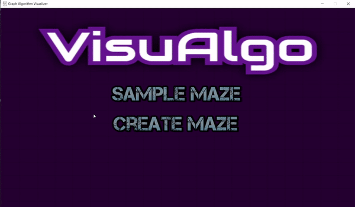
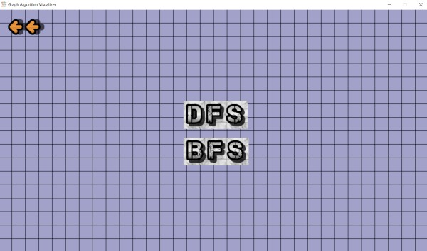
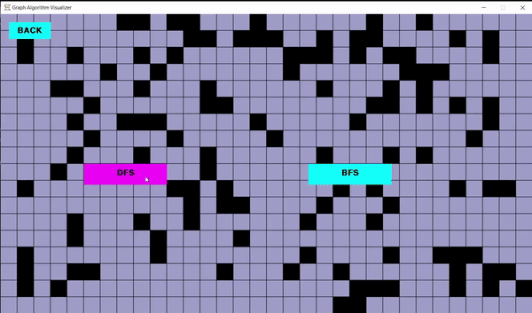
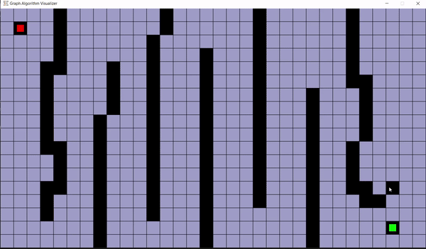

 

# VisuAlgo: A path-finding visualization tool 

A tool for visualizing the workings of famous pathfinding algorithms like Breadth-First Search (BFS) and Depth-First Search (DFS), with the following functionalities:
* Users can choose start and end points.
* Users can build walls. 

## Requirements
* [Python3](https://www.python.org/)
* [Pip](https://pypi.org/project/pip/)
* [PyGame](https://www.pygame.org/wiki/about)
* [Tkinter](https://docs.python.org/3/library/tkinter.html)
* [Sys](https://docs.python.org/3/library/sys.html)
* [OS](https://docs.python.org/3/library/os.html)

## Run in Local Machine
Download or clone the repository. Then run the following command in the downloaded directory:
> pip install -r requirements.txt
> python VisuAlgo.py

Note: For running VisuAlgo, all necessary libraries must be installed, or it will not execute. An `.exe` (executable) file is also available [here](https://drive.google.com/file/d/1CEI5kGXMa2iAeE08iS-hnM4kIWZzKri0/view?usp=sharing).

## Instructions 
1.  **Choose Maze Type**: Start by selecting whether to draw a `Custom maze` or generate a `Random Maze`.

    

2.  **Select Algorithm**: After setting up the maze, choose whether to visualize `BFS` (Breadth-First Search) or `DFS` (Depth-First Search).

    

3.  **Visualize**:
    *   Watch DFS explore the maze:

        
      
    *   Watch BFS explore the maze:

        
  
  
## Controls
The application uses a combination of keyboard keys and mouse inputs:

*   **Mouse Clicks**:
    *   **Left Click**: 
        *   Select Start and End points on the grid.
        *   Draw walls (when in "Custom Maze" mode after placing Start/End).
        *   Interact with UI buttons (e.g., "Random Maze", "DFS", "BFS").
    *   **Right Click**:
        *   Deselect Start or End points if clicked on them.
        *   Erase walls (when in "Custom Maze" mode after placing Start/End).
*   **Keyboard**:
    *   `r` : **Restart** - Resets the application to the initial screen.
    *   `enter` : **Start Algorithm** - Begins the visualization of the selected path-finding algorithm (after Start/End points are set).
    *   `space-bar` : **Pause/Resume** - Pauses or resumes the algorithm visualization.

## Algorithm
 ### DFS (Depth-First Search):
  The Depth First Search (DFS) is a fundamental search algorithm used to explore nodes and edges of a graph. It explores as far as possible along each branch before backtracking. DFS has a time complexity of O(V+E) and a space complexity of O(V) in the worst case (where V is the number of vertices and E is the number of edges). It is often used as a building block in other algorithms.
  By itself the DFS isn’t all that useful, but when augmented to perform other tasks such as count connected components, determine connectivity, or find bridges/articulation points then DFS really shines.
   
   
   
 ### BFS (Breadth-First Search):
  The Breadth First Search (BFS) is another fundamental search algorithm used to explore nodes and edges of a graph. It explores layer by layer, visiting all neighbors at the present depth before moving to the next level. BFS has a time complexity of O(V+E) and a space complexity of O(V) in the worst case (where V is the number of vertices and E is the number of edges).
  The BFS algorithm is particularly useful for one thing: finding the shortest path on unweighted graphs.
  
  

## Code Structure

The main logic of VisuAlgo is contained within `VisuAlgo/VisuAlgo.py`. The code is structured around Pygame for visualization and Tkinter for the initial UI.

-   **`Spot` Class**: Represents individual cells in the grid.
    -   **Purpose**: Holds the state of each cell, such as its position, whether it's a wall, visited, or part of the path.
    -   **Key Attributes**:
        -   `x`, `y`: Coordinates of the cell in the grid.
        -   `neighbors`: A list to store adjacent, traversable cells.
        -   `wall`: Boolean, `True` if the cell is a wall, `False` otherwise.
        -   `visited`: Boolean, `True` if the cell has been visited by an algorithm.
        -   Other attributes like `previous` (for path reconstruction), `color`, etc.

-   **Main Game Loop**: The core of the visualization, driven by Pygame.
    -   Handles user input events (mouse clicks, key presses).
    -   Updates the game state based on user actions or algorithm progression.
    -   Renders the grid, cells, walls, and algorithm visualization on the screen.

-   **Key Functions/Logic Blocks**:
    -   **Grid Initialization and Setup**: Creates the grid of `Spot` objects, sets up initial start and end points.
    -   **Wall Creation and Handling**: Allows users to draw or erase walls by clicking on cells, updating the `wall` attribute of `Spot` objects.
    -   **Algorithm Execution**:
        -   Initiates BFS or DFS based on user selection.
        -   Visualizes the algorithm's progress by changing cell colors (e.g., for visited cells, cells in the queue/stack, or the final path).
    -   **UI Interaction**:
        -   Initial dialog (using Tkinter) for selecting maze type (Custom/Random) and algorithm (BFS/DFS).
        -   Handles button clicks within the Pygame window (e.g., Start, Restart).
  
## Contributions
We welcome all kinds of contributions from the open-source community! Whether it's feedback, bug reports, or feature suggestions, please feel free to share. For more information on how to contribute, please see our `CONTRIBUTING.md` file.

We also encourage improvements to our contribution guidelines; `CONTRIBUTING.md` could be expanded with details on the development process, such as coding style, how to submit pull requests, or setting up a development environment.

## License

This project is licensed under the MIT License - see the [LICENSE.md](LICENSE.md) file for details.
